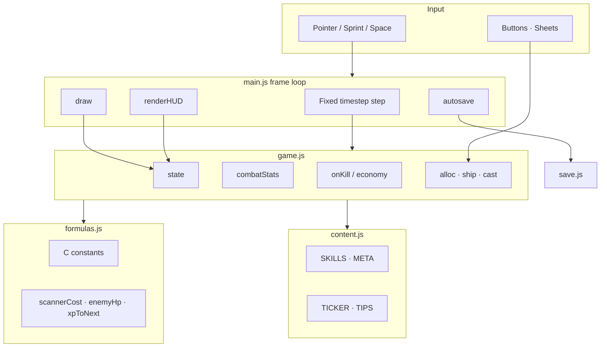

# Architecture

## Goals

1. **Playable as static files** — no build step required for players.
2. **Testable domain** — Node can import `game.js` / `formulas.js` without DOM.
3. **Safe to grow** — skills, meta, biomes, embed, optional bundler later.
4. **Clear ownership** — one place for balance, one place for copy, one place for draw.

## Runtime diagram



## Module contracts

### `formulas.js`

- Export `C` (balance table) and pure functions.
- No `document`, no `localStorage`, no randomness that depends on UI.
- Safe in Node tests.

### `game.js`

- `createState()`, `step(s, dt)`, economy actions (`buyScanner`, `allocSkill`, …).
- Owns `s.world` (enemies, particles, sprint flag) and `s.run` / `s.meta`.
- May import comedy / content; must still run under Node with stubbed optional SFX.

### `content.js`

- Player-facing names and descriptions.
- Skill graph requirements (`req: { scan, verify, amplify }`).
- Ticker rows and tips.
- Prefer **not** embedding damage numbers here — point at systems instead.

### `render.js`

- Stateless draw from `s` (except image cache).
- Procedural biomes + sprite blit.
- Never grant currency.

### `ui.js`

- DOM generation for Build / Publish / Boosts.
- Binds clicks → domain actions → `save(s)`.
- Afford states (`is-locked`, `can`, SP badge).

### `save.js`

- Schema version `v: 1`.
- Persist run + meta + settings; strip ephemeral anim fields.

### `sfx.js`

- WebAudio only; no-ops without `window` / until unlocked by gesture.

## State shape (conceptual)

```text
s
├── meta        live, season, kills, ships, bosses
├── authority   amount (Rep), shippedThisSeason, upgrades{}
├── run
│   ├── zone, killsInZone
│   ├── bytes (Signal), patches (Notes)
│   └── hero { level, xp, sp, scan, verify, amplify, scanner, skills, mask, energy, mana, … }
├── world       enemies, alerts, floaters, particles, confetti, sprinting, scroll
├── ui          panel, toast, seasonDone, tips, chipPulse, fx
├── stats       dps, combo
└── settings    reducedMotion, sfx, lastTs
```

Naming debt: internal `bytes` / `patches` / `authority` / `scan` map to UI Signal / Notes / Rep / Damage. Renames should be schema-migrated in `save.js` when done.

## Fixed timestep

```text
rAF → accumulate real dt → while acc >= FIXED_DT (1/60):
         step(s, FIXED_DT)
     draw once per frame
     HUD throttle ~12.5 Hz
     save ~every 6s
```

Keeps combat deterministic enough for headless tests and fair offline simulation.

## Extension points

| Want | Where |
|------|--------|
| New skill | `content.SKILLS` + `game.combatStats` / cast + optional chip |
| New boost | `content.META` + `metaPer` usage |
| New enemy type | `ENEMY_FLAVOR` + sprite + `typeHpMult` / rewards |
| New biome | `render.js` BIOMES array |
| New currency | formulas + game grant + HUD chip + save migrate |
| 3D hero | GLB assets already in `assets/`; replace `drawHero` path |
| Bundler | Optional later; keep import map simple |

## Testing strategy

```text
qa/run-tests.mjs
  → import game + formulas
  → simulate steps without canvas
  → assert kills, ship, boss, zone > 20, soft HP scale
```

CI runs the same command (see `.github/workflows/ci.yml`).

## Non-goals (v1)

- Multiplayer / accounts
- Server authoritative combat
- Paid IAP (site may add later as separate product surface)
- Heavy frameworks (React/Vue) for the playable core
