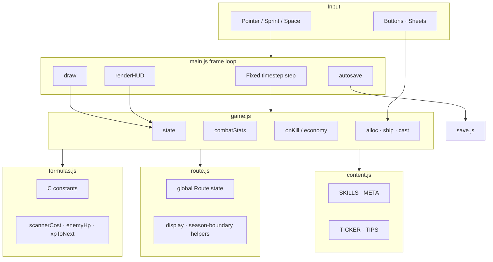

<!-- go-live-v2-superseded -->
> **⚠ Superseded on the prestige model (go-live v2).** This document still describes the retired **Ship Notes + End Season** model. The current design is **Go Live** — a single atomic prestige checkpoint (first at zone 10, then every 20; see [ADR-0008](decisions/ADR-0008-go-live-sole-checkpoint.md)). Read it through **plan v2** (`docs/superpowers/plans/2026-07-16-infinite-patchline-go-live-v2.md`) and **`docs/product/RECONCILIATION.md`**; where they disagree, they win. Non-prestige content here may still be accurate.

# Architecture

## Goals

1. **Playable as static files** — no build step required for players.
2. **Testable domain** — Node can import `game.js` / `formulas.js` without DOM.
3. **Safe to grow** — skills, meta, catalog-driven Game Packs, embed, optional bundler later.
4. **Clear ownership** — one place for balance, one place for copy, one place for draw.

## Runtime diagram



## Module contracts

### `formulas.js`

- Export `C` (balance table) and pure functions.
- Own named-ability SP costs, exact spent-SP reconstruction, Verify yield, and
  Relay offline-efficiency formulas. Presentation never recreates these values.
- No `document`, no `localStorage`, no randomness that depends on UI.
- Safe in Node tests.

### `game.js`

- `createState()`, `step(s, dt)`, economy actions (`buyScanner`, `allocSkill`, …).
- Owns `s.world` (enemies, particles, sprint flag), `s.run`, `s.meta`, and Route
  state transitions. Combat reads world progress from `s.route`.
- May import comedy / content; must still run under Node with stubbed optional SFX.
- Build V2 exposes `branchMastery` / `buildMastery` as derived values. Scan uses
  combat-throughput skills, Verify owns cycle-value yield, and Relay owns offline
  continuity; the retired generic attributes are not combat inputs.
- Priority Tag is a `game.js` target-state mechanic. It consumes Focus, records the
  purchased rank on the current enemy, and multiplies only that enemy's Signal and
  Notes reward. `render.js` reads the tag solely to draw its targeting brackets.

### `route.js`

- Pure global Route state construction, sanitization, display, and boundary helpers.
- Stable string IDs and route history survive End Season; no DOM or storage access.
- Owns pure pack lookup, seeded two-pack scheduling, least-recent revisit selection,
  and bounded corruption tier. Renderer never chooses Route content.

### `generated/game-packs.js`

- Frozen runtime catalog generated from 20 stable `assets/game-packs/*/pack.json` sources.
- Generation is byte-stable; source manifests own identity, roles, pivots, and paths.
- Never hand-edit the generated module or persist array indexes in saves.

### `content.js`

- Player-facing names and descriptions.
- Direct Scan / Verify / Relay skill definitions and branch presentation metadata.
- Ticker rows and tips.
- Prefer **not** embedding damage numbers here — point at systems instead.

### `render.js`

- Stateless draw from `s` plus an explicit decoded asset store.
- The scheduled Game Pack owns the happy-path environment and target atlas;
  procedural Patchline scenery is a missing/slow-asset fallback only.
- Never grant currency.

### `assets.js`

- Owns browser decode promises and explicit current/next Game Pack references.
- Deduplicates loads, treats props/masks as optional, releases cold decoded images,
  and never keeps more than two pack records after a transition.
- Reads pure Route scheduling; it does not calculate combat or choose balance.

### `ui.js`

- DOM generation for Build / Go Live / Boosts.
- Binds clicks → domain actions → `save(s)`.
- Afford states (`is-locked`, `can`); SP and Mastery remain inside Build.

### `save.js`

- Schema version `v: 3`; writes `apn_idle_save_v2` only and refuses to overwrite
  a higher-version save.
- Loads v3, then v2/v1. Build V2 is a second shape migration inside v3:
  legacy attribute points plus reconstructible named-skill costs are refunded
  exactly once, the old allocation is cleared, and `hero.buildVersion=2` marks it.
- The v1 key remains rollback evidence until explicit New Game clears both keys.
- Persist Route + run + meta + settings (including Gear sort/filter preferences);
  strip ephemeral animation fields.

### `sfx.js`

- WebAudio only; no-ops without `window` / until unlocked by gesture.

## State shape (conceptual)

```text
s
├── meta        live, season, kills, ships, bosses
├── authority   amount (Rep), shippedThisSeason, upgrades{}
├── route       zone, killsInZone, currentPackId, history, deck, seed, catalogVersion
├── run
│   ├── bytes (Signal), patches (Notes)
│   └── hero { level, xp, sp, scanner, skills, buildVersion, energy, focus, … }
├── world       enemies, alerts, floaters, particles, confetti, sprinting, scroll
├── ui          panel, toast, seasonDone, tips, chipPulse, fx
├── stats       dps, combo
└── settings    reducedMotion, sfx, gearSort, gearFilter, lastTs
```

Naming debt: internal `bytes` / `patches` / `authority` map to UI Signal / Notes /
Rep. `scan` / `verify` / `amplify` remain temporary derived-read compatibility
through PR-4b; they no longer store purchasable power. Renames must be migrated in
`save.js`, never performed as a blind field swap.

## Fixed timestep

```text
rAF → accumulate real dt → while acc >= FIXED_DT (1/60):
         step(s, FIXED_DT)
     draw once per frame
     HUD throttle ~12.5 Hz
     save ~every 6s
```

Keeps combat deterministic enough for headless tests and fair offline simulation.

## Extension points

| Want | Where |
|------|--------|
| New skill | `content.SKILLS` + `game.combatStats` / cast + optional chip |
| New boost | `content.META` + `metaPer` usage |
| New Game Pack | manifest + generated catalog + static atlas; schedule at End Season |
| New fallback enemy type | `ENEMY_FLAVOR` + sprite + `typeHpMult` / rewards |
| New currency | formulas + game grant + HUD chip + save migrate |
| 3D hero | GLB assets already in `assets/`; replace `drawHero` path |
| Bundler | Optional later; keep import map simple |

## Testing strategy

```text
qa/run-tests.mjs
  → import game + formulas
  → simulate steps without canvas
  → assert kills, ship, boss, zone > 20, soft HP scale
```

CI runs the same command (see `.github/workflows/ci.yml`).

## Non-goals (v1)

- Multiplayer / accounts
- Server authoritative combat
- Paid IAP (site may add later as separate product surface)
- Heavy frameworks (React/Vue) for the playable core

Save schema v2 still round-trips the retired `meta.premium` demo-store object for
backward compatibility. The free MVP treats every value in that object as inert;
only `meta.live` contributes to the global economy multiplier.
